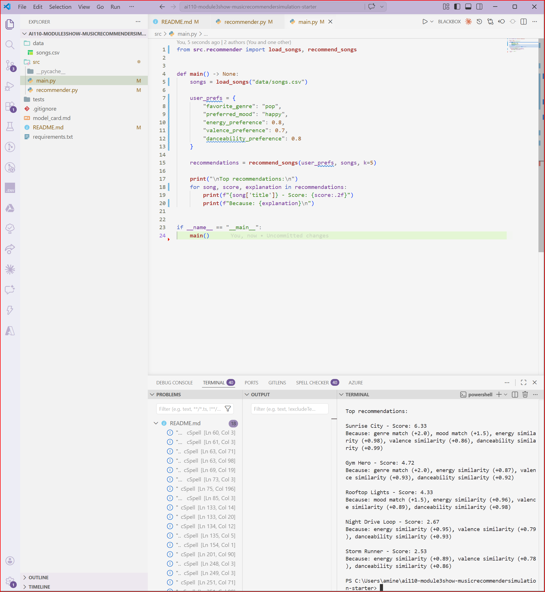

this is README.md # 🎵 Music Recommender Simulation

## Project Summary

In this project you will build and explain a small music recommender system.

Your goal is to:

- Represent songs and a user "taste profile" as data
- Design a scoring rule that turns that data into recommendations
- Evaluate what your system gets right and wrong
- Reflect on how this mirrors real world AI recommenders

This project implements a simple content-based music recommendation system. It analyzes song attributes such as genre, mood, energy, and tempo, and compares them to a user’s preferences. Each song is assigned a score based on how closely it matches the user’s taste profile. The system then ranks the songs and recommends the top matches. This simulation demonstrates how real-world recommendation systems transform data into personalized suggestions.

---

## How The System Works

This system uses a content-based recommendation approach. Instead of relying on other users’ behavior, it focuses on matching song attributes with a user's preferences.

  ### Song Features

Each `Song` in the system includes:
- Genre
- Mood
- Energy
- Tempo (BPM)

These features help represent the overall "vibe" of a song.

  ### User Profile

The `UserProfile` stores:
- Favorite genre
- Preferred mood
- Energy preference

This defines what kind of music the user likes.

  ### Scoring Logic

The recommender calculates a score for each song using a weighted approach:

- Genre match → highest weight
- Mood match → medium weight
- Energy → scored based on how close it is to the user's preference

Songs that are more similar to the user’s preferences receive higher scores.

### Data Used

The system uses a dataset of songs stored in `songs.csv`. Each song includes:

- Genre (categorical)
- Mood (categorical)
- Energy (0.0–1.0)
- Tempo (BPM)
- Valence (happiness level)
- Danceability (rhythm suitability)
- Acousticness (acoustic vs electronic)

The dataset was expanded to include a wider variety of genres such as lofi, rock, ambient, jazz, synthwave, and indie pop to improve diversity in recommendations.

### User Profile

The recommender uses a predefined user taste profile:

- Favorite genre: lofi
- Preferred mood: chill
- Energy preference: 0.4
- Valence preference: 0.6
- Danceability preference: 0.6

This profile represents a user who prefers calm, relaxed, and moderately upbeat music. These features allow the system to distinguish between very different styles such as intense rock and chill lofi.

### Algorithm Recipe

The recommender uses a weighted scoring system to evaluate each song:

- +2.0 points if the song genre matches the user’s favorite genre
- +1.5 points if the song mood matches the user’s preferred mood
- Energy similarity score based on closeness to the user’s preference
- Valence similarity score based on closeness
- Danceability similarity score based on closeness

For numerical features, the score is calculated as:

    similarity = 1 - |song_value - user_preference|

This ensures songs closer to the user’s preferences receive higher scores.

After calculating scores for all songs, they are ranked from highest to lowest, and the top songs are recommended.

### System Flow

```mermaid
flowchart TD
    A[User Profile] --> B[Load Songs CSV]
    B --> C[Loop Through Songs]
    C --> D[Calculate Score]
    D --> E[Store Score]
    E --> F[Sort Songs]
    F --> G[Top Recommendations]


    
---

## 🔹Expected Bias 

### Potential Bias

This system may over-prioritize genre, meaning it could ignore songs that match mood or energy but belong to a different genre.

It may also create a "filter bubble" by repeatedly recommending similar types of music, reducing exposure to new genres.

Additionally, numerical features like energy and valence may favor songs within a narrow range, limiting diversity in recommendations.


After scoring all songs:
- Songs are sorted from highest to lowest score
- The top songs are selected as recommendations

This process simulates how real recommendation systems rank and suggest content based on relevance.
## Getting Started

### Setup

1. Create a virtual environment (optional but recommended):

   ```bash
   python -m venv .venv
   source .venv/bin/activate      # Mac or Linux
   .venv\Scripts\activate         # Windows

2. Install dependencies

```bash
pip install -r requirements.txt
```

3. Run the app:

```bash
python -m src.main
```

### Running Tests

Run the starter tests with:

```bash
pytest
```

You can add more tests in `tests/test_recommender.py`.

---

## Experiments You Tried

Use this section to document the experiments you ran. For example:

- What happened when you changed the weight on genre from 2.0 to 0.5
- What happened when you added tempo or valence to the score
- How did your system behave for different types of users

---

## Limitations and Risks

Summarize some limitations of your recommender.

Examples:

- It only works on a tiny catalog
- It does not understand lyrics or language
- It might over favor one genre or mood

You will go deeper on this in your model card.

---

## Reflection

Read and complete `model_card.md`:

[**Model Card**](model_card.md)

Write 1 to 2 paragraphs here about what you learned:

- about how recommenders turn data into predictions
- about where bias or unfairness could show up in systems like this


---

## 7. `model_card_template.md`

Combines reflection and model card framing from the Module 3 guidance. :contentReference[oaicite:2]{index=2}  

```markdown
# 🎧 Model Card - Music Recommender Simulation

## 1. Model Name

Give your recommender a name, for example:

> VibeFinder 1.0

---

## 2. Intended Use

- What is this system trying to do
- Who is it for

Example:

> This model suggests 3 to 5 songs from a small catalog based on a user's preferred genre, mood, and energy level. It is for classroom exploration only, not for real users.

---

## 3. How It Works (Short Explanation)

Describe your scoring logic in plain language.

- What features of each song does it consider
- What information about the user does it use
- How does it turn those into a number

Try to avoid code in this section, treat it like an explanation to a non programmer.

---

## 4. Data

### Data Used

The system uses a dataset of songs stored in `songs.csv`. Each song includes:

- Genre (categorical)
- Mood (categorical)
- Energy (0.0–1.0)
- Tempo (BPM)
- Valence (happiness level)
- Danceability (rhythm suitability)
- Acousticness (acoustic vs electronic)

The dataset was expanded to include a wider variety of genres such as lofi, rock, ambient, jazz, synthwave, and indie pop to improve diversity in recommendations.


## 5. Strengths

Where does your recommender work well

You can think about:
- Situations where the top results "felt right"
- Particular user profiles it served well
- Simplicity or transparency benefits

---

## 6. Limitations and Bias

Where does your recommender struggle

Some prompts:
- Does it ignore some genres or moods
- Does it treat all users as if they have the same taste shape
- Is it biased toward high energy or one genre by default
- How could this be unfair if used in a real product

---

## 7. Evaluation

How did you check your system

Examples:
- You tried multiple user profiles and wrote down whether the results matched your expectations
- You compared your simulation to what a real app like Spotify or YouTube tends to recommend
- You wrote tests for your scoring logic

You do not need a numeric metric, but if you used one, explain what it measures.

---

## 8. Future Work

If you had more time, how would you improve this recommender

Examples:

- Add support for multiple users and "group vibe" recommendations
- Balance diversity of songs instead of always picking the closest match
- Use more features, like tempo ranges or lyric themes

---

## 9. Personal Reflection

A few sentences about what you learned:

- What surprised you about how your system behaved
- How did building this change how you think about real music recommenders
- Where do you think human judgment still matters, even if the model seems "smart"

## Example Output

Below is a sample output from the recommender system:



## Evaluation Results

