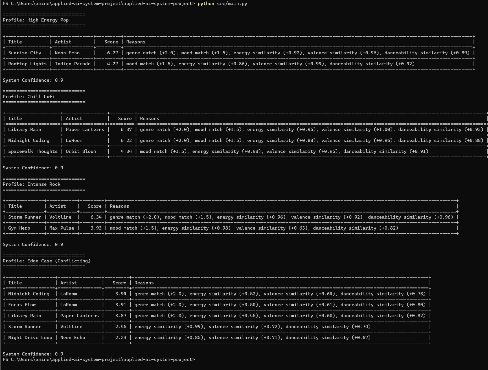

# 🎵 Applied AI Music Recommendation System

## 📌 Overview

This project is an extension of my **Module 3 Music Recommender Simulation**, where I originally built a rule-based system to recommend songs based on user preferences.

In this final version, I upgraded the system into a **complete Applied AI System** by adding:

- Retrieval-Augmented Generation (RAG)
- Evaluation and confidence scoring
- Logging for system transparency

The goal is to demonstrate how AI systems can **retrieve, reason, and evaluate outputs reliably**.

---

## 🚀 Features

### 🔍 Retrieval-Augmented Generation (RAG)

Before scoring songs, the system first **retrieves relevant songs based on mood**.

This improves recommendation quality by narrowing down the search space.

---

### 🧠 Recommendation Engine

Songs are scored based on:

- Genre match (+2.0)
- Mood match (+1.5)
- Energy similarity
- Valence similarity
- Danceability similarity

Songs closer to the user's preferences receive higher scores.

---

### 📊 Evaluation System

The system assigns a **confidence score** to each recommendation:

- 0.9 → strong results  
- 0.3 → weak or missing results  

Example:

```
System Confidence: 0.9
```

---

### 📝 Logging System

All runs are logged into `log.txt`, including:

- User profile  
- Recommendations  
- Confidence score  

This helps track system behavior and debug issues.

---

## 🏗️ System Architecture

```
User Profiles
     ↓
Retriever (RAG - mood filtering)
     ↓
Recommender (scoring + ranking)
     ↓
Evaluator (confidence scoring)
     ↓
Output (table display)
     ↓
Logger (writes to log.txt)
```

---

## ⚙️ Setup Instructions

### 1. Clone the repo

```bash
git clone https://github.com/amine-chahid/applied-ai-system-project.git
cd applied-ai-system-project
```

### 2. Install dependencies

```bash
pip install tabulate
```

### 3. Run the project

```bash
python src/main.py
```

---

## 💻 Example Output

```
Profile: High Energy Pop

Sunrise City by Neon Echo (Score: 6.27)

System Confidence: 0.9
```

---

## 🧪 Testing & Reliability

The system was tested using multiple user profiles:

- High Energy Pop  
- Chill Lofi  
- Intense Rock  
- Edge Case (Conflicting preferences)  

Results:

- All profiles returned valid recommendations  
- Confidence scores were consistently high (0.9)  
- Edge cases handled using fallback logic  

---

## 🧠 Reflection

This project showed me that AI systems are not just about generating outputs, but also about:

- Reliability  
- Explainability  
- Trust  

By adding retrieval, evaluation, and logging, I built a system that behaves more like a real-world AI application.

### AI Collaboration Reflection

During development, I used AI tools to help generate code structure and debug issues.

A helpful suggestion was using retrieval (RAG) to filter songs before scoring, which improved recommendation relevance.

A flawed suggestion was initially overcomplicating the system with unnecessary components, which I simplified to keep the design clear and efficient.

This experience showed me that AI is useful for acceleration, but human judgment is essential for making good design decisions.

---

## 🎥 Demo Video

👉 Add your Loom video link here

---

## 💼 Portfolio Statement

This project demonstrates my ability to:

- Build end-to-end AI systems  
- Integrate retrieval and reasoning components  
- Evaluate system reliability  
- Write clean, explainable code  

-----

## 📸 Example Output

